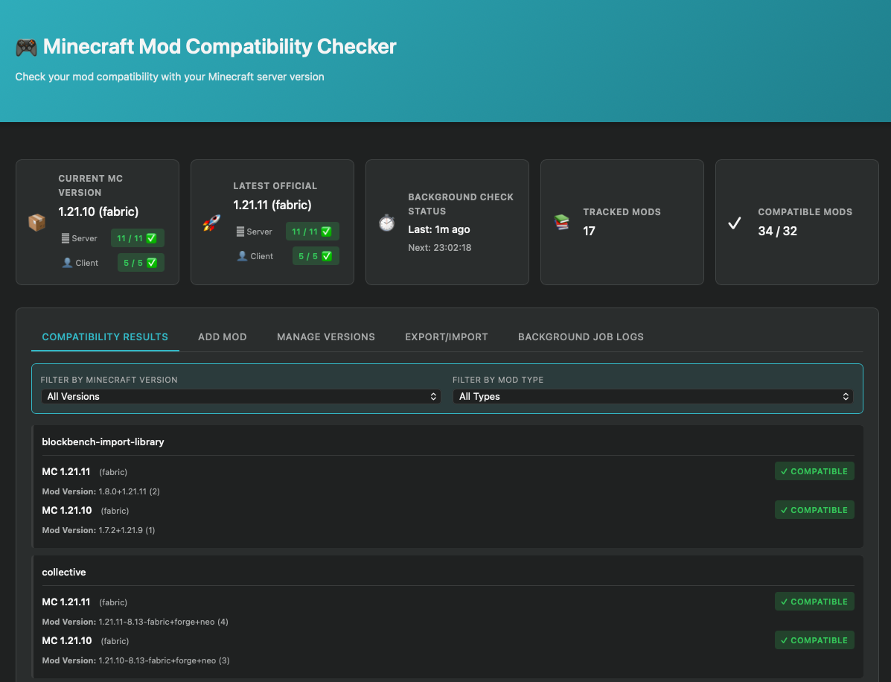
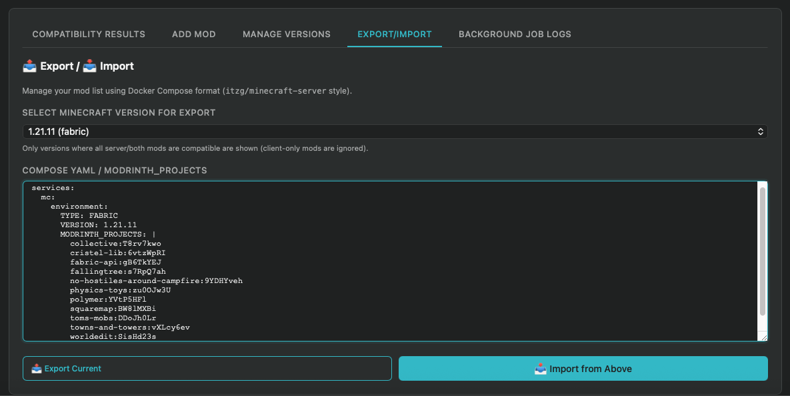

# Minecraft Mod Compatibility Checker

Semi Vibecoded (An experiment to see how good is current state of AI)

A simple web application to check compatibility of Minecraft mods against the latest game version using the Modrinth API.





## Features
- Fetches latest Minecraft release version automatically
- Checks mod compatibility for specific loaders (Fabric/Forge/etc)
- Background job updates status every 1 hour
- Clean, responsive UI
- Docker support
- Docker export support for itzg/minecraft-server mods configuration

## Development Setup

### Prerequisites
- Python 3.11+
- pip

### Installation
1. Create a virtual environment:
   ```bash
   python -m venv .venv
   source .venv/bin/activate  # on Windows: .venv\Scripts\activate
   ```

2. Install dependencies:
   ```bash
   pip install -r requirements.txt
   ```

3. Run the application:
   ```bash
   uvicorn app:app --reload
   ```

4. Access at http://localhost:8000

## Running Tests

The project uses `pytest` for testing.

```bash
# Install test dependencies (if not already installed)
pip install pytest pytest-asyncio httpx

# Run tests
pytest
```

## Docker Deployment

### Standard Docker Setup
1. Build and run the container:
   ```bash
   docker-compose up --build -d
   ```
2. Access at http://localhost:8000

The database will be persisted in the `./data` directory.

### Podman (macOS)
If you are using Podman on macOS, you may need to use the local Unix socket and bypass credential helpers to avoid connectivity issues:

1. **Run with socket override**:
   ```bash
   DOCKER_CONFIG=$(mktemp -d) DOCKER_HOST="unix:///var/run/docker.sock" docker-compose up --build -d
   ```

   > **Note**: Ensure `/var/run/docker.sock` points to your active Podman machine socket (e.g., via `podman-mac-helper`).

2. **View logs**:
   ```bash
   docker-compose logs -f
   ```
